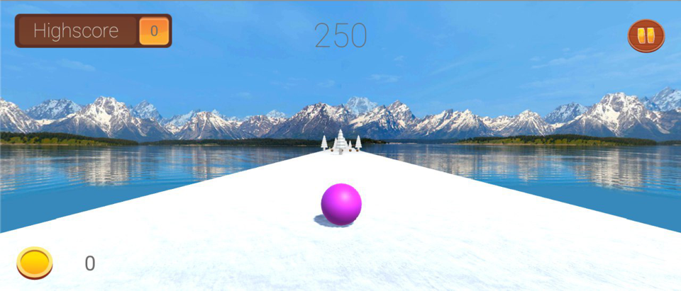
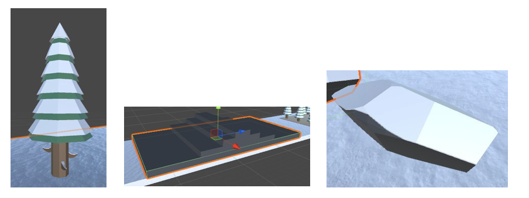

# GRESBALL

## Introducción

GRESBall es un juego de realidad virtual el cual trata de sumergir al jugador en un mundo de obstáculos y dificultados. El usuario deberá de hacer uso de sus reflejos y habilidades para sortear los distintos obstáculos que han sido situados de manera estratégica para hacer la experiencia del jugador lo más divertida y amena posible. Además de la versión de realidad virtual podemos jugar a GRESBall desde nuestro ordenador, en tal caso usaremos el teclado para controlar el movimiento del personaje.

---
## Controles del Juego

Una vez estemos hayamos iniciado el juego y seleccionado el nivel en el cual jugar, deberemos de evitar los obstáculos con la bola que aparecerá en pantalla. Para ello se ha implementado un control de movimiento a través del giroscopio del dispositivo móvil que estemos usando, de esta manera cuando el usuario quiera mover la pelota hacia la derecha deberá de girar con su cabeza hacia la derecha para que la bola siga la trayectoria deseada. La velocidad de la bola es constante, aunque en algunas fases del juego atravesaremos algunas zonas que harán que la velocidad aumente considerablemente.

---
## Aspectos a destacar (Hitos)

El juego presenta algunas características extras como una tienda en la que podemos cambiar los distintos aspectos de nuestro personaje, cabe destacar que para cambiar dichos aspectos necesitaremos monedas. Dichas monedas son recogidas por el usuario durante el juego, de tal manera que cuando el usuario desee pueda cambiar el aspecto de la esfera. Por otra parte en el menú principal de nuestro juego aparecen algunos botones con los que podemos conectar directamente con las redes sociales del juego. Además de esto disponemos de un apartado de ajustes.

---
## Contenidos impartidos y usados

Para el desarrollo de nuestra aplicación hemos utilizado algunos de los conceptos que hemos impartido durante las clases. El de mayor importancia, debido a que supone el control del personaje, es el uso del giroscopio. Tal y como hicimos en una clase de prácticas hemos utilizado el movimiento del dispositivo móvil para controlar el personaje de nuestra escena.

---
## Elementos del juego

Una vez el usuario está dentro de un nivel, su objetivo es el de evitar obstáculos y llegar a la meta como se comentó anteriormente. Sin embargo, en su camino al objetivo, se va a encontrar con diferentes elementos, clasificados principalmente en: obstáculos, rampas, cocos y piñas.

### Obstáculos
Se trata de todo tipo de objeto con el cual el personaje no podrá chocar, ya que se acabará la partida de forma inmediata. Los hay de 3 tipos: árboles, bloques (deslizantes o fijos) y rocas.

### Rampas

Las rampas, son un tipo especial de roca, en el cual la bola puede subir, y saltar un determinado tiempo en el aire. Además, la bola ve incrementado su tamaño un 50% durante unos segundos.

### Cocos
Los cocos, son elementos con los que `SÍ` puede interactuar la bola, ya que son elementos los cuales el usuario debe recolectar para poder comprar diferentes bolas en la tienda posteriormente. Cada vez que la pelota recolecta un coco, el usuario recibirá 100 monedas.

### Piñas
Las piñas son objetos que, al igual que los cocos, sí pueden ser colisionados con la bola. En su caso, disminuyen el tamaño del personaje un 50% durante unos segundos, permitiendo una mayor visibilidad y agilidad para evitar obstáculos.

## Reparto del trabajo
El desarrollo del trabajo, ha estado bien diferenciado en diferentes fases hasta llegar a su finalización. En un principio, los integrantes Eduardo de la Paz y Sergio García, se encargaron de los sistemas de menús. Los menús están compuestos principalmente por: menú principal, niveles y tienda. Además en esta fase, se empezó a desarrollar un nivel 1 muy básico, proceso en el que colaboró también Guillermo Esquivel.
En la segunda fase del proyecto, Eduardo de la Paz le añadió assets a todo el sistema de menús, para darle una mayor calidad visual a la aplicación, además de todo el sistema de sonidos, con el cual el usuario tiene una experiencia más interactiva dentro del juego. En esta segunda fase, Guillermo Esquivel concluyó el nivel 1, corrigiendo algunos errores existentes y teniendo ya una versión estable del juego con 1 nivel. En este punto, Sergio García comenzó a desarrollar el nivel 2.
En una tercera fase del proyecto, Sergio García, finalizó el desarrollo del nivel 2, diseñando todos los obstáculos y añadiendo diferentes assets para ambientar aún más el juego. Este paso del proceso lo desarrolló junto con Ruymán Rodríguez, que añadió además algunos scripts para el funcionamiento del juego y corrigió errores en el movimiento de la bola.
Por último, Ruymán Rodríguez aplicó todo el proceso de añadir RV a nuestra aplicación. En este paso se empezó a trabajar con la retícula y surgieron más problemas a partir de ello que el propio Ruymán solventó con éxito. Finalizado el proceso de RV, nuestra aplicación ya se dio por concluida.
Además, Guillermo Esquivel, Sergio García y Eduardo de la Paz, redactaron este informe mientras Ruymán hacía las últimas modificaciones en el movimiento de la bola.

---
## Integrantes del equipo

* **Eduardo de la Paz González**, [alu0100893267](https://alu0100893267.github.io).
* **Guillermo Esquivel González**, [alu0100881677](https://alu0100881677.github.io).
* **Ruymán Rodríguez Martín**, [alu0100845235](http://alu0100845235.github.io/).
* **Sergio García de la Iglesia**, [alu0100892260](https://sergiogarciadli.github.io).
